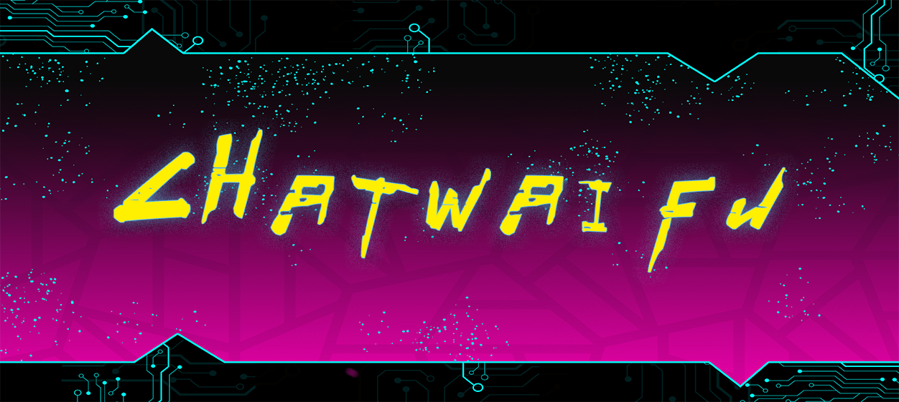

<p align="center">
	
	
  	<a href="https://app.fossa.com/projects/git%2Bgithub.com%2Fcjyaddone%2FChatWaifu?ref=badge_small" alt="FOSSA Status"></a>
</p>

# ChatWaifu with iSTFT-VITS integration

> ## How to run
### Create virtual environment (optional)
```
python -m venv venv
venv\Scripts\activate
```
### Install pytorch
```
pip3 install torch==1.13.1 torchvision==0.14.1 torchaudio==0.13.1 --index-url https://download.pytorch.org/whl/cu117
```
### Install requirements
```
pip3 install -r requirements.txt
```
if error occurs, install visual studio and build tools and try again.

### Install Ren'py
- Download [Ren'py sdk](https://www.renpy.org/latest.html) and add path to environment variable
- Install Live2D library
```
Setting - Install library - Install Live2D Cubism
```

### Place your vits model in ./userfile/tts/
structure example:
```
──┬─userfile/tts/
  ├── config.json
  └── model.pth
```

### Run server
```
python server.py
```

### Run game
```
renpy ./ChatWithGPT/
```
You can get api key [here](https://platform.openai.com/account/api-keys)

## Credits
- [ChatWaifu] https://github.com/cjyaddone/ChatWaifuL2D
- [MB-iSTFT-VITS] https://github.com/MasayaKawamura/MB-iSTFT-VITS
